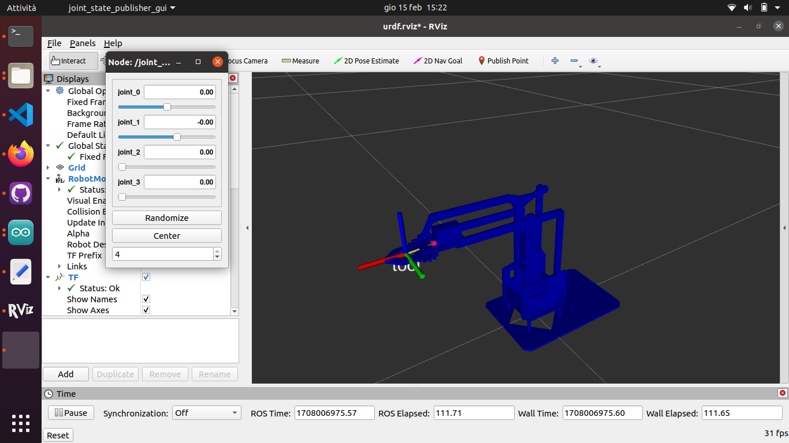

# MeArm Robot ROS-Arduino Integration

This project showcases the integration of the MeArm robotic arm with ROS (Robot Operating System) using an Arduino as the intermediary controller. It demonstrates how to control the MeArm robot's servo motors through ROS topics and services, allowing for precise and flexible manipulation tasks.

The project was developed for the course of Robot Programming (2023/2024) in University of Salerno, final paper and presentation can be found in 
 (`MeArm/doc`)
## Project Overview

The goal of this project is to leverage the capabilities of ROS for high-level control while using Arduino for low-level hardware interfacing. This approach enables a modular and scalable system that can be extended for various robotic applications.

### Features

- Control MeArm servo motors through ROS messages.
- Set predefined poses for the MeArm using ROS services.
- Real-time manipulation and feedback through the integration of ROS and Arduino.
- Modular and scalable architecture suitable for educational purposes and robotic experiments.

## Getting Started

These instructions will get you a copy of the project up and running on your local machine for development and testing purposes.

### Prerequisites

- [ROS Noetic](http://wiki.ros.org/noetic/Installation/Ubuntu) installed on Ubuntu 20.04.
- [Arduino IDE](https://www.arduino.cc/en/software) for programming the Arduino board.
- MeArm robot kit assembled with an Arduino compatible board.

## Usage

1. Clone the repository to your local machine:
    ```bash
    git clone https://github.com/yourrepository/MeArm_ROS_Arduino.git
    ```

2. Navigate to the cloned directory:
    ```bash
    cd MeArm_ROS_Arduino
    ```

3. Compile any necessary ROS packages:
    ```bash
    catkin_make
    source devel/setup.bash
    ```

4. Connect the Arduino to your computer and upload the provided Arduino sketch (`MeArm/mearm.ino`) using the Arduino IDE.

5. Run the ROS nodes for manual control of the robot ():
    ```bash
    roslaunch mearm_move display.launch
    rosrun rosserial_python serial_node.py _port:=/dev/ttyACM0 _baud:=115200
    ```
This command will open the RViz interface, as we see in figure below:


6. To control the robot using a service:
    ```bash
    roslaunch mearm_move service.launch
    rosrun rosserial_python serial_node.py _port:=/dev/ttyACM0 _baud:=115200
    rosservice call /select_position_set "set_name: 'set3'"
    ```

## License

This project is licensed under the MIT License - see the [LICENSE.md](https://github.com/yourrepository/MeArm_ROS_Arduino/blob/main/LICENSE) file for details.

